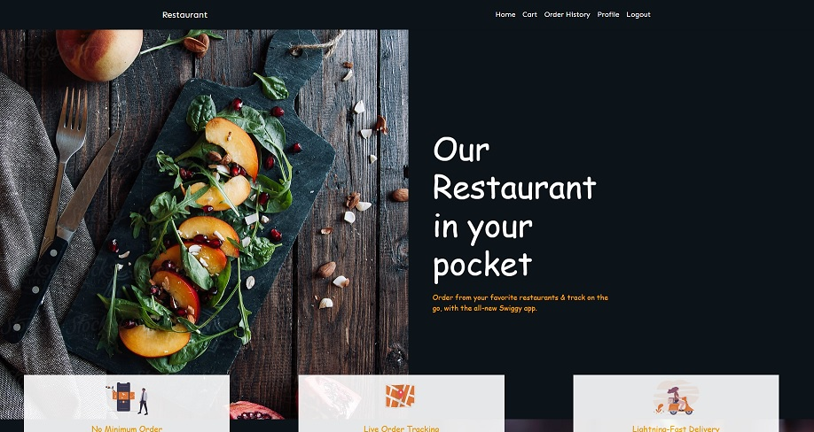
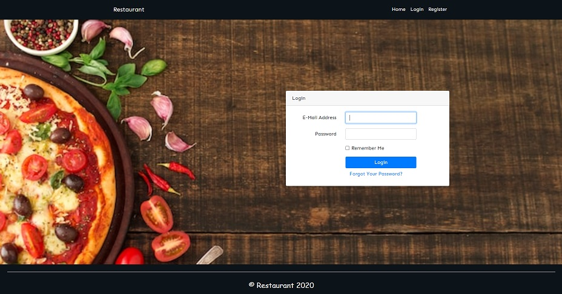
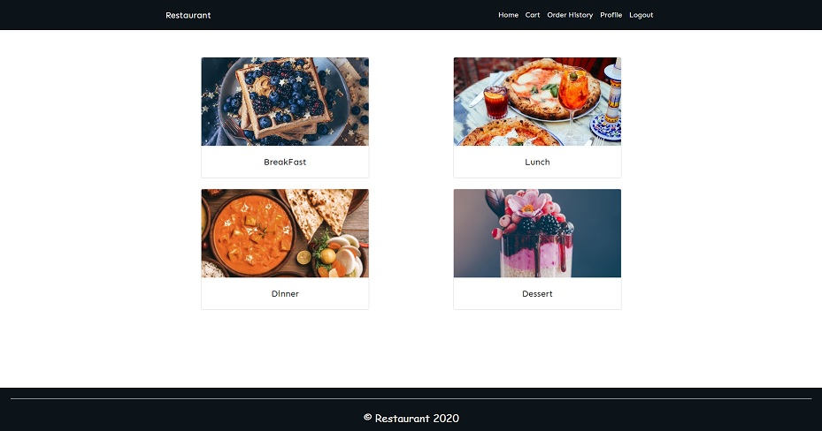

# lara6bs-pocket-restaurant

> ### This is a Restaurant app build using `Laravel` as backend framework. This app is using `Bootstrap` for Styling the webpage. This app has Guest view for unauthorized users, User View for Customers and admin view to manage the food items and Orders.

## Get Started

- Run `XAMPP for Windows 7.4.29` => `PHP Version 7.4.29`
- Clone the repo using command `git clone ~`
- Duplicate the `.env.example` with the name `.env`
- Create a **database** with name `restaurant`.
- Run the following commands in turn:

    ```bash
    $ npm install
    $ composer install
    $ php artisan migrate
    $ php artisan key:generate
    $ php artisan serve
    ```
- You are now good to go [Pocket Restaurant](http://127.0.0.1:8000)!



## Features



#### Guest

- Can View the homepage
- Register
- Login

> Every logged in user is considered as Customer of the website.

#### Customer

- Can view the product(food)
- Add the food to the cart
- Order the food
- can see the Order History
- can see the Order Status



#### Admin

- View the Orders of the customer
- can Cancel the Order of the customer
- can approve the Order of the customer

---

&copy; 2020-2023 `@liyang51827` All Right Reserved.
